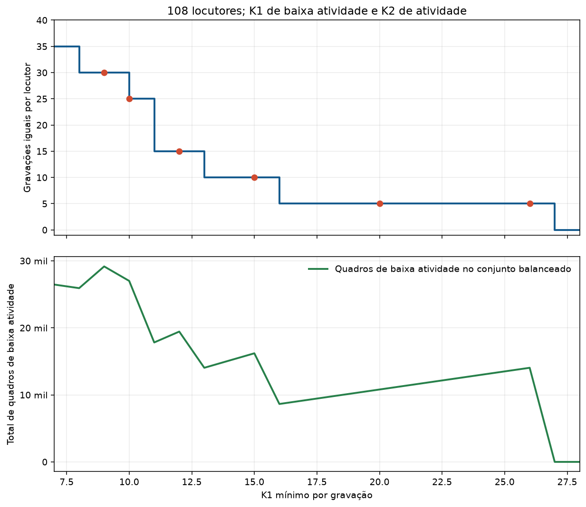

# Quantos quadros de baixa atividade cabem com 108 locutores?

Fonte: `vctk_activity8k_counts.csv`, calculado sobre os áudios completos dos dois
microfones, após a detecção de atividade em 8 kHz. Uma gravação é elegível
quando possui ao menos **K1 quadros de baixa atividade** e **K2 quadros de
atividade** em posições válidas nos dois microfones. Os mesmos instantes podem
ser usados nas duas captações. Baixa atividade é um rótulo de energia, não uma
anotação de silêncio puro.

Exigências desta análise: 108 locutores; exatamente a mesma quantidade de
gravações selecionadas por locutor; em cada uma das cinco partições, 60% dessas
gravações para treino, 20% para validação e 20% para teste. Por isso a
quantidade por locutor é múltipla de cinco. K1 e K2 podem ser diferentes.
As gravações elegíveis que excedem o número comum são descartadas.

| K1 baixa | Máx. gravações iguais por locutor | Divisão por locutor em cada partição | K2 atividade máximo nesse grupo | Total de gravações selecionadas | Total de quadros de baixa atividade |
|---:|---:|---:|---:|---:|---:|
| 9 | 30 | 18 / 6 / 6 | 54 | 3.240 | 29.160 |
| 10 | 25 | 15 / 5 / 5 | 42 | 2.700 | 27.000 |
| 11 | 15 | 9 / 3 / 3 | 71 | 1.620 | 17.820 |
| 12 | 15 | 9 / 3 / 3 | 42 | 1.620 | 19.440 |
| 15 | 10 | 6 / 2 / 2 | 42 | 1.080 | 16.200 |
| 20 | 5 | 3 / 1 / 1 | 42 | 540 | 10.800 |
| 26 | 5 | 3 / 1 / 1 | 42 | 540 | 14.040 |
| 27 | inviável | — | — | — | — |

**Leitura:** o maior K1 matematicamente possível é **26**. Nesse ponto, K2
pode ser até **42**, mas só restam cinco gravações por locutor: três no treino,
uma na validação e uma no teste de cada partição. Com K1=20, a quantidade de
gravações por locutor é a mesma; portanto, K1=26 aproveita mais quadros sem
diminuir mais o conjunto. Se o objetivo for maximizar o total de quadros de
baixa atividade no conjunto com gravações iguais por locutor, o melhor ponto é
**K1=9, 30 gravações por locutor**, somando 29.160 quadros de baixa atividade.
O valor 9 proporciona 8% mais quadros de baixa atividade que o valor 10,
que proporciona 27.000.

O maior K2 na tabela foi calculado **para a quantidade máxima de gravações por
locutor daquela linha**. Um K2 menor pode deixar mais gravações elegíveis no
corpus, mas a quantidade selecionada continua limitada pelo locutor com menos
gravações elegíveis. Os números de `analise_balanceamento_atividade_vctk.csv`
contêm a fronteira para todos os pares K1 e quantidade por locutor.

## Por que tão poucas gravações?

O limite vem de alguns locutores, não da maioria. Com K1=K2=10, há 17.272
gravações elegíveis no total e a mediana entre locutores é **184**, mas o
locutor **p267** tem apenas **25**. Com K1=K2=20, a mediana é **164,5** e p267
tem apenas **5**. O locutor p364 também é incomum: tem 29 gravações elegíveis
em 10+10 e 11 em 20+20. Em ambos, a mediana dos quadros de baixa atividade
por gravação é apenas um, segundo este detector. Exigir o mesmo número bruto
de gravações para os 108 obriga descartar muitas gravações dos demais
locutores. Essa perda não indica, por si só, que os áudios não contêm silêncio:
o rótulo depende do detector de energia e da concordância dos dois microfones.

## Relação com a divisão anterior

A divisão anterior atribuía o grupo de cada gravação pelo número original do
enunciado, módulo cinco. Se **esses grupos originais também forem imutáveis**,
será preciso selecionar o mesmo número de gravações em cada grupo de cada
locutor. Nessa condição mais forte, o máximo K1 é **11**, com uma gravação por
grupo e cinco por locutor. Para K1=10, cabem três gravações por grupo, isto é,
15 por locutor. K1=20 não cabe porque ao menos um grupo original de um locutor
fica vazio. Para alcançar 20 ou 26, seria necessário formar novamente os cinco
grupos entre as gravações elegíveis, mantendo a proporção 60/20/20 e fixando a
nova atribuição igualmente para ambos os microfones e todas as condições.
Resultados já treinados com os grupos originais não seriam comparáveis sem
repetir o treino na mesma coorte e partição.

Esta análise apenas calcula viabilidade; nenhum treino foi iniciado com esses
novos cortes.
