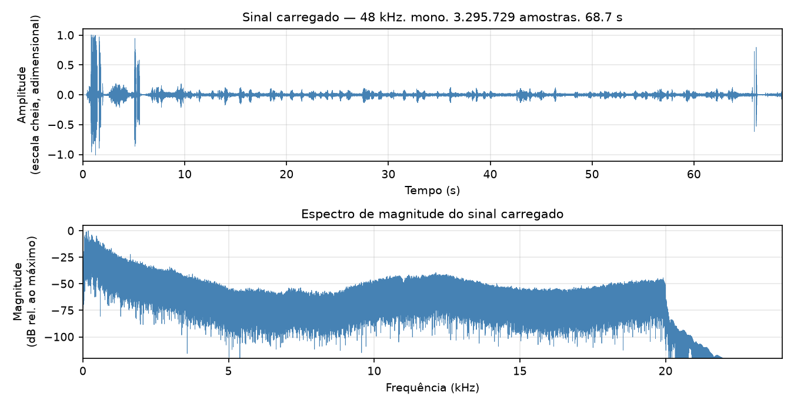
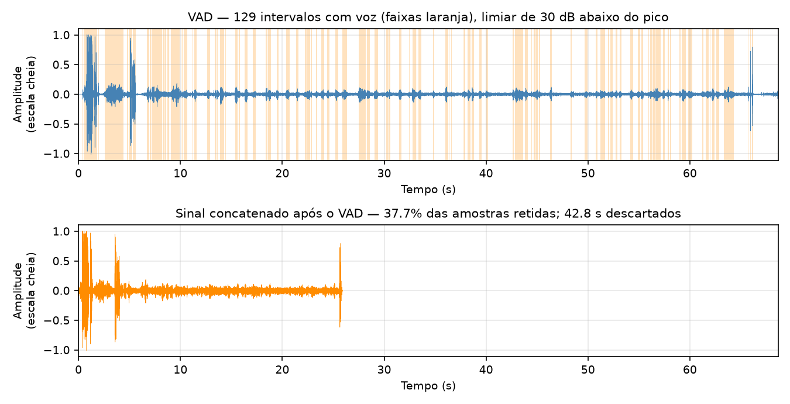
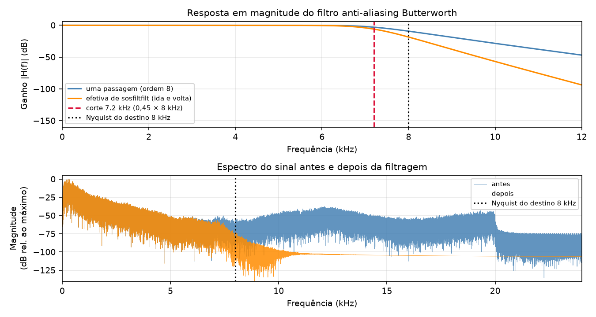
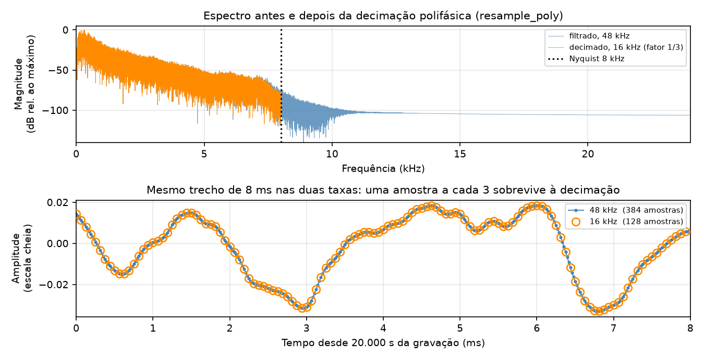
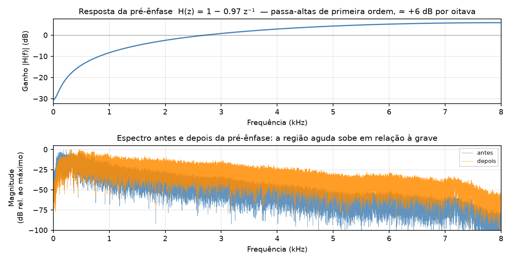
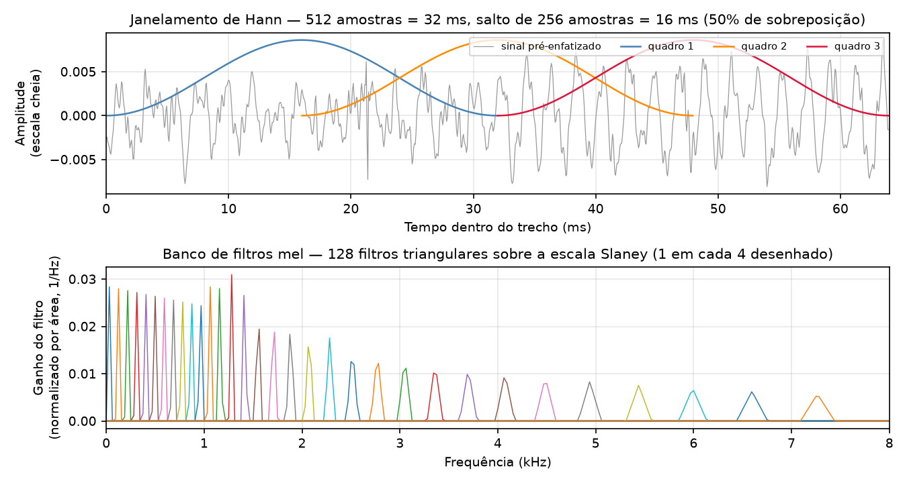
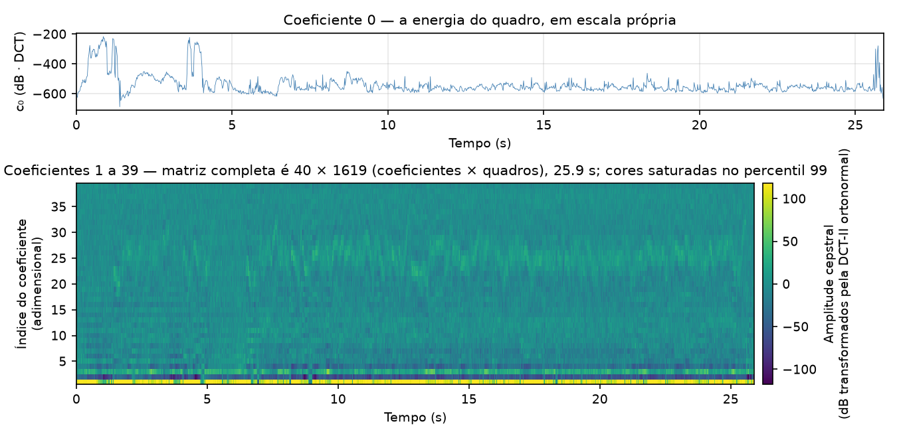

# Apresentação — como os experimentos foram feitos

## Datasets

Dois corpora, escolhidos porque carregam **confundidores distintos** entre identidade
do locutor e condição de gravação. Não são duas réplicas do mesmo experimento.

| | BrSD | VCTK 0.92 |
|---|---|---|
| **Locutores** (corpus / usados) | **80 / 80** | **110 / 108** |
| Gravações por locutor (usadas) | 5 | ~400 (200) |
| Total de gravações | 400 | 21.523 por trilha |
| Duração por gravação | 16 s a 1 min 56 s (mediana 29 s) | poucos segundos |
| Texto | **dependente** (mesmos 5 textos) | **independente** |
| Microfones | **um por locutor** (aparelho próprio) | **dois, simultâneos** |
| Taxa / formato | 48 kHz · **WMA, com perda** | 48 kHz · FLAC, sem perda |
| **Licença** | **não declarada** ("freely available") | **CC BY 4.0** |
| Obtenção | [sites.google.com/view/brsduem](https://sites.google.com/view/brsduem) | DOI [10.7488/ds/2645](https://doi.org/10.7488/ds/2645) |
| Acaso (1/N) | 1,25% | 0,93% |

**O confundidor do BrSD: um dispositivo por locutor.** Cada pessoa gravou no próprio
celular, em ambiente não controlado. A assinatura de canal — resposta em frequência,
ruído de fundo, ganho, codec — é constante dentro do locutor e distinta entre
locutores, ou seja, **um identificador perfeito da pessoa, sem voz nenhuma**. Nenhuma
partição corrige isso: conjunto fechado exige o locutor nos dois lados, logo o
aparelho dele também aparece nos dois.

**O confundidor do VCTK: sessão.** Mesma sala e mesmo equipamento para todos, então o
modelo do microfone deixa de predizer o rótulo, e o texto é independente. Mas cada
locutor foi gravado em **uma única sessão**: ganho do dia, distância e postura,
respiração. O confundidor muda de *dispositivo* para *sessão*, a estrutura é a mesma.
Em compensação, as duas trilhas gravam a mesma frase ao mesmo tempo — voz, texto e
instante idênticos, só o transdutor muda —, e é isso que viabiliza os protocolos
**cross-microfone** (treinar numa trilha, avaliar na outra) e **multi-microfone**.

**Por que 108 e não 110.** `p280` e `p315` não têm trilha `mic2`, e ocupam as posições
54 e 84 da ordenação. Numerando cada trilha isoladamente, tudo a partir da 54 desloca
em um: **57 dos 110 locutores recebiam rótulo trocado**, e o teto de acurácia era
**48,2%**, não 100% — foi contra esse teto que os 24,09% anteriores foram medidos. A
numeração passou a sair da **interseção** das trilhas; alinhamento verificado depois,
com recuperação do par correto **100/100** entre 20 distratores.

**O BrSD é distribuído em WMA**, codec com perda, a montante de tudo e irreversível. É
o mesmo codec para todos, logo não distingue locutores por si — mas a interação entre
codec e canal distingue, porque aparelhos diferentes levam o encoder a alocar bits de
formas diferentes. É mais uma camada da assinatura de canal.

> **Atribuição.** VCTK: Yamagishi, Veaux & MacDonald (2019), *CSTR VCTK Corpus* v0.92.
> BrSD: Paulino, M. A et al., *A Brazilian Speech Database*, ICTAI 2018 — sem licença
> declarada: uso acadêmico, sem redistribuição, a confirmar com os autores.

---

## Pré-processamento — do sinal bruto aos MFCCs

Cadeia canônica, na ordem exata em que `sr/preprocessing/pipeline.py` a executa:

```
carregar → [VAD] → anti-aliasing → decimação → pré-ênfase → janelamento → mel → log → DCT
```

As figuras abaixo saem de **uma gravação real percorrendo as mesmas funções do
pipeline** (`figuras_cadeia.py` chama `sr.preprocessing.signal`, não reimplementa
nada). O perfil ilustrado é `brsd_vad.env`, cuja cadeia é idêntica à do perfil de
referência do VCTK; o perfil de referência do BrSD difere só em taxa de destino
(8 kHz) e janela (256 amostras).

| parâmetro | BrSD ref. | BrSD/VCTK 16 kHz | onde |
|---|---|---|---|
| Taxa de origem | 48 kHz | 48 kHz | `SOURCE_SAMPLING_RATE` |
| Taxa de destino | 8 kHz | 16 kHz | `TARGET_SAMPLING_RATE` |
| VAD | desligado | ligado, 30 dB | `ENABLE_VAD`, `VAD_TOP_DB` |
| Ordem do anti-aliasing | 8 | 8 | `ANTIALIAS_ORDER` |
| Corte do anti-aliasing | 3,6 kHz | 7,2 kHz | 0,45 × Nyquist do destino |
| Pré-ênfase | 0,97 | 0,97 | `PRE_EMPHASIS_COEF` |
| Janela | 256 (32 ms) | 512 (32 ms) | `FRAME_SIZE` |
| Salto | 128 (16 ms) | 256 (16 ms) | `FRAME_SIZE / 2` |
| Coeficientes | 40 | 40 | `NUM_MFCCS` |

### 1. Carregamento

`librosa.load(caminho, sr=48000)` — devolve **mono, float32, escala cheia em
[−1, +1]**. A conversão para mono e a reamostragem para 48 kHz acontecem aqui, o que
uniformiza os arquivos heterogêneos do BrSD. Nenhum ganho é aplicado: a amplitude é
adimensional e não corresponde a pressão sonora, então só diferenças **relativas**
dentro da mesma gravação têm sentido físico.



*Gravação de 68,7 s (3.295.729 amostras). No espectro, note o corte abrupto em 20 kHz: é o codec WMA do
BrSD, não o nosso processamento — o corpus já chega com a banda superior removida.*

### 2. Detecção de atividade vocal (VAD)

`librosa.effects.split(audio, top_db=30)`, com os defaults da biblioteca:
`frame_length=2048` (**42,7 ms** a 48 kHz), `hop_length=512` (**10,7 ms**),
referência e agregação pelo **máximo**. Mantém os intervalos cuja energia fique a
menos de 30 dB abaixo do pico, e **concatena** — a saída não preserva a linha do
tempo original.

O complemento exato dessa operação (`extract_silence`) é o **controle negativo** do
trabalho: se a identidade do locutor for predita a partir do que o VAD jogou fora,
ela não está sendo lida da voz.



*Nesta gravação o VAD encontra 129 intervalos com voz e retém 37,7% das amostras: 68,7 s viram 25,9 s, e 42,8 s são descartados. O painel de baixo mantém a mesma escala de tempo para tornar o encurtamento visível. "Silêncio" aqui
é o complemento de um detector de **energia**, não uma anotação de ausência de fala:
pode conter respiração e fala fraca.*

### 3. Filtro anti-aliasing

Butterworth passa-baixas de **ordem 8**, corte em **0,45 × Nyquist do destino** —
7,2 kHz para destino de 16 kHz. Aplicado com `sosfiltfilt`, que filtra para frente e
para trás: a fase resultante é **exatamente nula** e a magnitude é elevada ao
quadrado, dobrando a atenuação em dB.

A filtragem de fase zero não é preciosismo. A filtragem direta introduz atraso de fase
dependente da frequência, que desloca os formantes uns em relação aos outros ao longo
do tempo — e a análise cepstral registraria esse deslocamento como se fosse
propriedade do sinal.

| frequência | 1 passagem | efetivo (`sosfiltfilt`) |
|---|---:|---:|
| 7,2 kHz (corte) | −3,0 dB | −6,0 dB |
| 8,0 kHz (Nyquist do destino) | −9,2 dB | −18,5 dB |
| 9,0 kHz | −18,9 dB | −37,8 dB |
| 12,0 kHz | −46,9 dB | −93,7 dB |



*A declarar com honestidade: em 8 kHz a atenuação é de apenas −18,5 dB, então conteúdo
logo acima do Nyquist do destino ainda rebateria com essa supressão. A proteção
principal vem do próprio `resample_poly`, que aplica um FIR de Kaiser interno; o
Butterworth é o pré-filtro com banda de guarda.*

### 4. Decimação

`resample_poly` — reamostragem **polifásica** por razão racional exata (48/16 = 3;
48/8 = 6). Não se usa o método por FFT porque ele pressupõe periodicidade do sinal e
produz artefatos nas bordas de gravações que não começam e terminam no mesmo valor.

A banda útil passa a ser **0 a 8 kHz** (ou 0 a 4 kHz no perfil de 8 kHz). O custo é
declarado: descarta-se a região onde reside parte da informação de locutor —
fricativas, formantes altos, detalhes da fonte glotal.



### 5. Pré-ênfase

FIR de primeira ordem, `y[n] = x[n] − 0,97·x[n−1]`, ou seja `H(z) = 1 − 0,97 z⁻¹`.
Passa-altas suave, de aproximadamente **+6 dB por oitava**, que compensa a queda
espectral da fala e equilibra a energia entre as regiões grave e aguda antes da
análise cepstral.

**Vem depois da decimação, e não antes.** É um filtro definido em relação à taxa de
amostragem final: aplicá-lo a 48 kHz colocaria o ponto de corte em outro lugar do
espectro que não o pretendido.



### 6. Janelamento

Janela de **Hann**, 512 amostras = **32 ms**, salto de 256 = **16 ms**, portanto 50%
de sobreposição. A duração é a convencional em análise de fala: longa o bastante para
conter vários períodos de pitch, curta o bastante para que o sinal seja
aproximadamente estacionário dentro dela. O perfil de 8 kHz usa 256 amostras,
preservando os mesmos 32 ms.

O `librosa` usa `center=True` com preenchimento por zeros, de modo que o número de
quadros é `1 + ⌊N/salto⌋` — nesta gravação, as 414.208 amostras que sobram após a
decimação produzem **1.619 quadros**.



### 7. Mel, logaritmo e DCT — a extração

Sobre cada quadro: espectrograma de **potência** (`power=2.0`), projetado em **128
filtros mel triangulares** na escala Slaney, normalizados por área. O resultado vai
para dB (`power_to_db`, referência 1,0, piso 80 dB abaixo do pico de cada gravação) e
sofre uma **DCT-II ortonormal**, da qual se retêm os **40 primeiros** coeficientes.
Sem liftering (`lifter=0`).

Os 40 coeficientes estão bem acima dos 13 a 20 usuais, e a consequência precisa ser
declarada: com 40, a DCT descarta pouca informação e o vetor se aproxima do log-espectro
mel completo. Os coeficientes de ordem alta descrevem estrutura espectral fina —
harmônicos, pitch e **coloração do canal** —, não apenas o envelope do trato vocal.
Aumentar o número de coeficientes aumenta simultaneamente a informação de voz e a de
equipamento disponíveis ao classificador.



*Saída final: matriz `(40 × 1619)` = `(coeficientes × quadros)`, gravada como
`mfccs.npy` em float32. O coeficiente 0 é a energia do quadro e tem ordem de grandeza
muito maior que os demais — por isso aparece em painel separado.*
