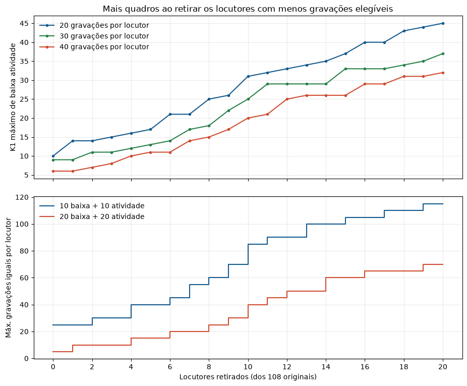

# Troca entre locutores, gravações e quadros de baixa atividade

Esta continuação de [`analise_balanceamento_atividade_vctk.md`](analise_balanceamento_atividade_vctk.md)
permite retirar os locutores com menos gravações elegíveis. Mantém o mesmo
número de gravações para **cada locutor que permanece** e a divisão exata
60/20/20 em cada uma das cinco partições. Os dois microfones usam os mesmos
áudios e posições de quadros. O detector de energia classifica atividade e
baixa atividade; esta última não equivale necessariamente a silêncio.

## Fixando K1=20 quadros de baixa atividade

| Locutores mantidos | Locutores retirados | Gravações por locutor | Gravações totais | Treino / validação / teste por locutor | K2 máximo de atividade |
|---:|---:|---:|---:|---:|---:|
| 108 | 0 | 5 | 540 | 3 / 1 / 1 | 42 |
| 107 | 1 | 10 | 1.070 | 6 / 2 / 2 | 63 |
| 104 | 4 | 15 | 1.560 | 9 / 3 / 3 | 75 |
| **102** | **6** | **20** | **2.040** | **12 / 4 / 4** | **59** |
| 100 | 8 | 25 | 2.500 | 15 / 5 / 5 | 67 |
| 99 | 9 | 30 | 2.970 | 18 / 6 / 6 | 57 |
| 98 | 10 | 40 | 3.920 | 24 / 8 / 8 | 25 |

K2 pode ser fixado em **20** para obter um controle 20+20 totalmente
equilibrado. Os valores maiores da última coluna são o máximo de atividade
possível mantendo K1=20 e a respectiva quantidade de gravações por locutor.
Em 20+20, retirar só p267 dobra as gravações iguais de 5 para 10 por locutor.
Para chegar a 20 gravações por locutor, precisam sair seis: **p267, p270,
p281, p347, p364 e p374**. Nesse ponto, 102 dos 108 locutores permanecem.

## Fixando 20 gravações por locutor

| Locutores retirados | Locutores mantidos | Maior K1 de baixa atividade | K2 máximo nesse K1 | Gravações totais |
|---:|---:|---:|---:|---:|
| 0 | 108 | 10 | 79 | 2.160 |
| 1 | 107 | 14 | 60 | 2.140 |
| 4 | 104 | 16 | 62 | 2.080 |
| 6 | 102 | 21 | 46 | 2.040 |
| 8 | 100 | 25 | 46 | 2.000 |
| 10 | 98 | 31 | 52 | 1.960 |

O ganho inicial é concentrado em poucos locutores. **Retirar 6 permite passar
de K1=10 para K1=21 mantendo 20 gravações por locutor**. A retirada muda a
tarefa de classificação: resultados com 102 classes não devem ser comparados
diretamente com acurácias de 108 classes. Para testar atividade versus baixa
atividade, todas as condições e os dois microfones precisam compartilhar a
mesma seleção de locutores, gravações e partições 60/20/20.

A tabela completa, para perdas de 0 a 20 locutores e 5 a 60 gravações por
locutor, está em [`fronteira_locutores_atividade_vctk.csv`](fronteira_locutores_atividade_vctk.csv).
Nenhum novo treino foi iniciado nesta análise.
