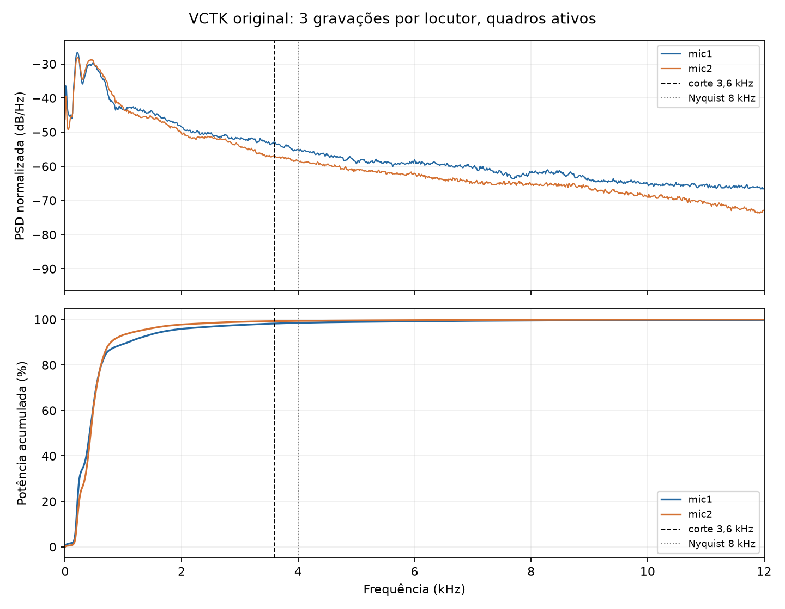

# Potência espectral do VCTK antes da redução para 8 kHz

Foram analisadas **324 gravações pareadas por microfone**: três enunciados
selecionados com semente 42 de cada um dos 108 locutores. O áudio FLAC original
foi lido em 48 kHz, antes do filtro antialiasing, da reamostragem e da pré-ênfase.

A PSD foi calculada em janelas Hann de 4.096 amostras, com 50% de sobreposição.
Para reduzir a influência de pausas, a média usa os quadros cuja potência fica
até 30 dB abaixo do pico da própria gravação. Esse critério indica atividade
acústica; não distingue perfeitamente voz de ruído. As porcentagens abaixo são
as medianas **por gravação**, para que cada arquivo tenha o mesmo peso.

| Faixa de frequência | Mic1 | Mic2 |
|---|---:|---:|
| Abaixo de 3,6 kHz (corte do filtro) | 98,25% | 99,38% |
| Abaixo de 4 kHz (limite da taxa de 8 kHz) | 98,59% | 99,46% |
| De 4 a 8 kHz | 0,86% | 0,38% |
| De 8 a 24 kHz | 0,32% | 0,10% |

Para a potência abaixo de 4 kHz, o intervalo interquartil é **97,16–99,39%**
no mic1 e **98,68–99,80%** no mic2. Há variação entre gravações; os menores
valores observados foram 84,29% e 81,53%, respectivamente.
Usando todos os quadros, inclusive as pausas, as medianas ficam praticamente
iguais: **98,59%** no mic1 e **99,46%** no mic2.

Isso mostra que **a maior parte da potência acústica** da amostra está dentro da
banda capturada por 8 kHz. Não demonstra que toda a **informação sobre o locutor**
esteja nessa banda: componentes de baixa potência acima de 4 kHz podem ser úteis
para identificação, e o perfil atual ainda corta o tempo de cada gravação.
Uma prova de adequação para a tarefa exige comparar modelos nas mesmas divisões
com bandas diferentes e medir a acurácia no teste.

Os números por gravação e a seleção estão em [psd_vctk_8k.json](psd_vctk_8k.json).
O cálculo reproduzível está em [psd_vctk_band.py](../experiments/psd_vctk_band.py).
